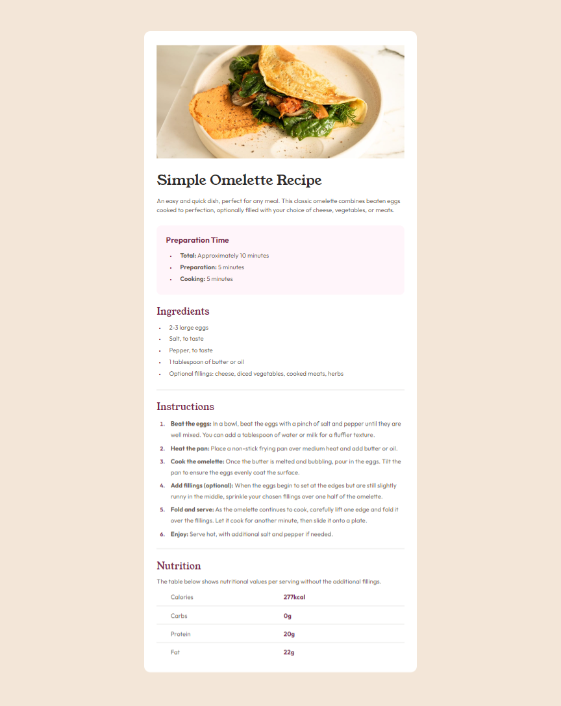

# Frontend Mentor - Recipe page solution

This is a solution to the [Recipe page challenge on Frontend Mentor](https://www.frontendmentor.io/challenges/recipe-page-KiTsR8QQKm). Frontend Mentor challenges help you improve your coding skills by building realistic projects.

## Table of contents

- [Overview](#overview)
  - [The challenge](#the-challenge)
  - [Screenshot](#screenshot)
  - [Links](#links)
  - [Built with](#built-with)
  - [Continued development](#continued-development)
- [Author](#author)

## Overview

This project focuses on developing a user interface that presents a simple recipe. The goal is to create a modern, fully responsive web application that offers a fluid user experience on a variety of devices, from smartphones to desktop computers.

### Screenshot

### Links

- Solution URL: [Solution](https://github.com/jabssdev/recipe-page)
- Live Site URL: [Live Site](https://jabssdev.github.io/recipe-page)

### Built with

- Semantic HTML5 markup
- CSS custom properties
- Flexbox
- CSS Grid
- Mobile-first workflow
- [Tailwind](https://tailwindcss.com/) - CSS Framework
- [React](https://reactjs.org/) - JS library
- [Vite](https://vitejs.dev/) - Build tool

### Continued development

In the near future I would like to learn how to use vue.js or the react framework, called next.js, as well as create a crud with some backend language like laravel or django, and be able to consume the data from the interface.

## Author

- Frontend Mentor - [@jabssdev](https://www.frontendmentor.io/profile/jabssdev)
- Twitter - [@10bsJordan](https://x.com/10bsJordan)
- Linkedin - [@jabssdev](https://www.linkedin.com/in/jabssdev/)
